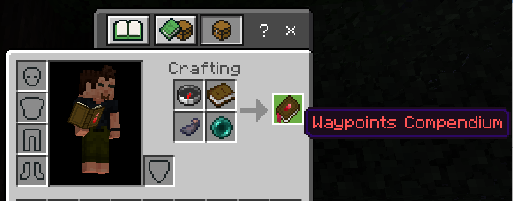
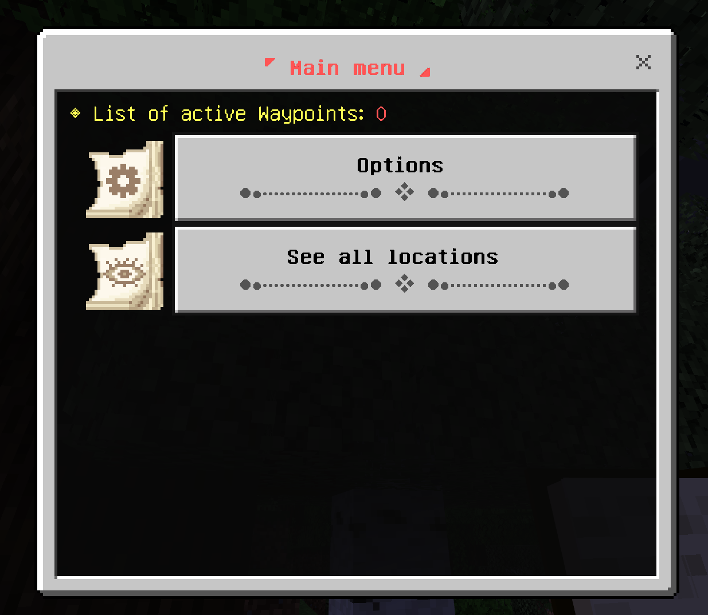
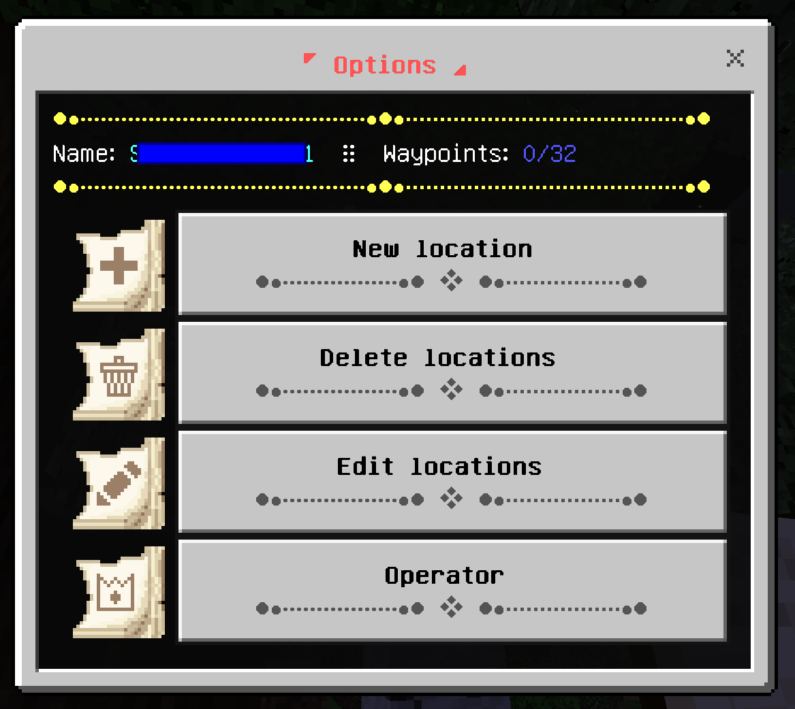
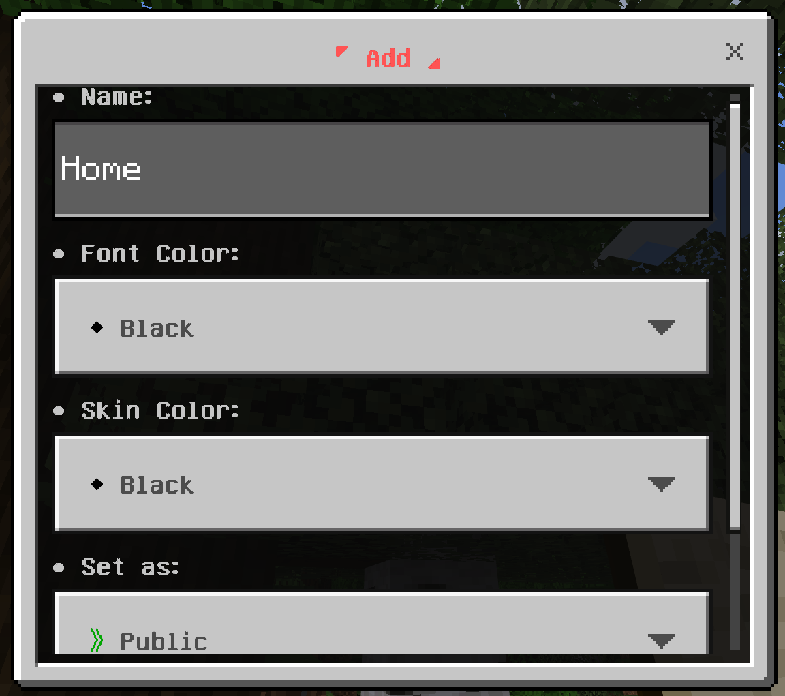
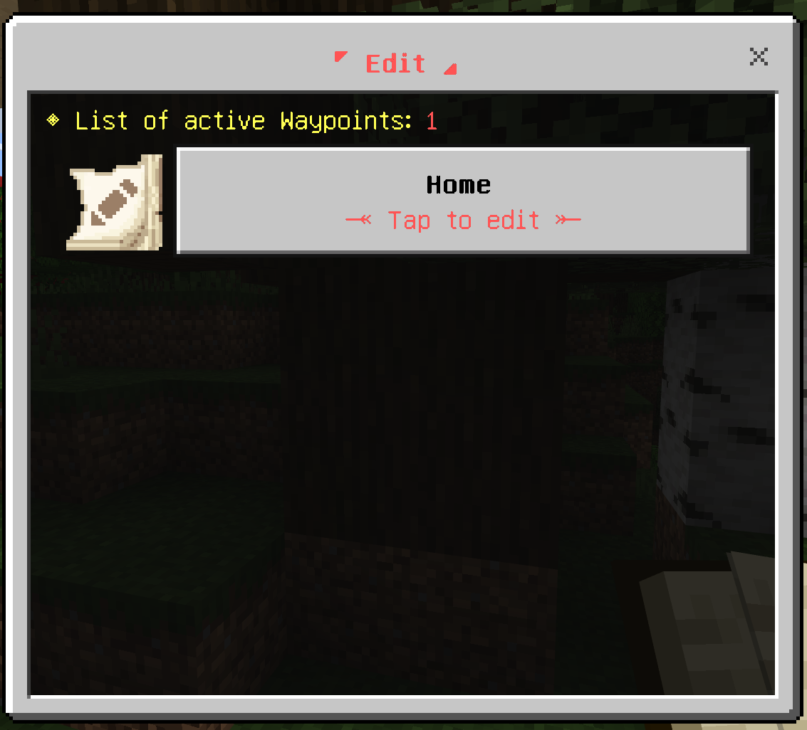
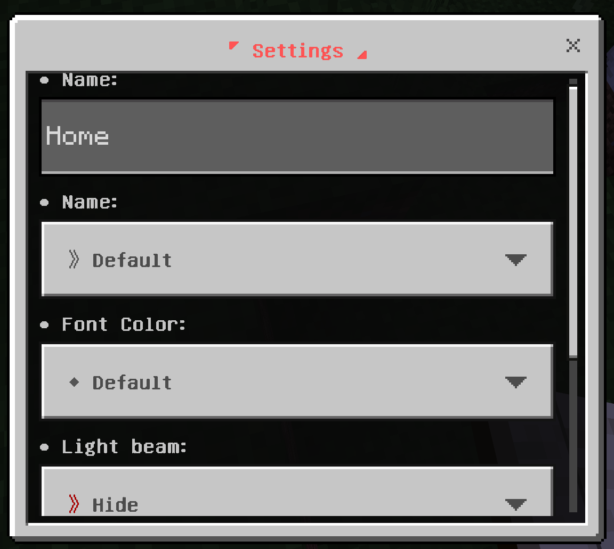

# Chatty's Waypoints (Minecraft Bedrock Add-On)
## Activity Log
2/16/2025
- Updated for the lastest MC 1.21.60 release
- Removed unused files from resource pack
- Updated format_version of entities and items in behavior pack
- Updated javascript for API compatibility

## Background
This addon was abandoned by its autor, Chetty O, after bedrock 1.20.60.  I thought it was pretty decent so I have revived it and I'm making it available again for everyone.

## Installation
Grab the latest .mcaddon from the releases page and install as usual.
[Latest release](https://github.com/shaiku/waypoints/releases/latest)
## Usage
### Crafting
Crafting a waypoints compendium requires a compass, book, ink sac, and ender pearl

### Main Menu

### Options Menu

### Add new waypoint

### Edit Waypoints

